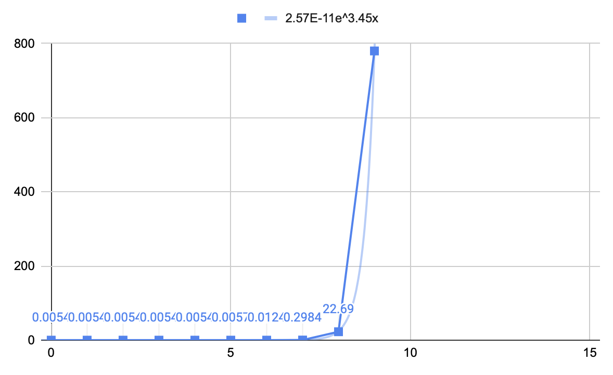
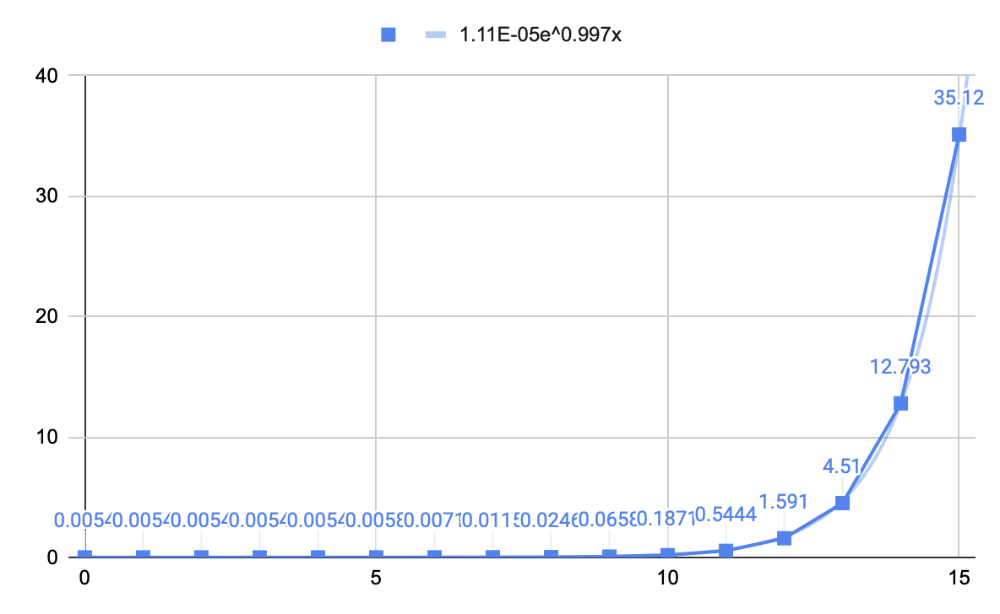

# Relatório 1º Projeto ASA 2022/2023 

## Grupo: tp012

**Alunos: David Pires (103458) Diogo Miranda (102536)**

## Descrição do Problema e da Solução

**Problema:** Dada uma matriz nxn, qual o número de combinações possível para cobrir essa mesma matrix com x quadrados de tamanho m x m.

**Solução:** Obtendo o vetor de colunas ocupadas por linha podemos ir inserindo quadrados m x m e decreescendo a linha onde foi colocado (e as seguintes (m-1) linhas) por m unidades. Para evitar combinações repetidas utilizámos um vetor auxiliar que guarda as colunas à esquerda ocupadas por linha. Utilizamos este vetor para dar prioridade à colocação de quadrados o mais à esquerda e cima possível (dando prioridade entre os dois à esquerda). Este método elimina o problema das combinações repetidas. Retirando a cada iteração do programa um quadrado atualiza-se os vetores que mapeiam a matriz do problema, quando a matriz ficar a zeros uma combinação foi alcançada. Focando-nos primeiro nos maiores quadrados e por fim nos 1 por 1 o programa acaba quando for alcançada a combinação de quadrados 1 por 1.

## Análise Teórica

- Ler o input dado (simples loop que lê todas as entradas): O(n)

- Criação do hashcode dos vectores de quadrados ocupado e livre (lê todas as entradas do vetor): O(n)

- Normalizar o vector de quadrados ocupados (lê todas as entradas do vetor): O(n)

- Verificar se o vector livre tem futura geração (lê todas as entradas do vetor): O(n) 

- Verificação se um quadrado m x m cabe no espaço disponível (lê as entradas do vetor desde a posição atual + m posições, onde m = lado do quadrado m x m a inserir) pior caso = quadrado n x n: O(n)

- Encontrar um vetor hashmap (todas as entradas podem estar no mesmo "bucket"): O(n)

- Colocar um vector no hashmap : O(1)

- Apresentação dos dados (simples std::cout de uma variável global) : O(1)

Complexidade Global (explicitada na última página) :

$$O({\mathrm{e}^n})$$

# Relatório 1º Projeto ASA 2022/2023

## Grupo: tp012 

**Alunos: David Pires (103458) Diogo Miranda (102536)**

## Avaliação Experimental dos Resultados

Ambos os gráficos demonstram o tempo de execução em segundos para uma matriz n por n que pode ser totalmente preenchida. O primeiro gráfico demonstra a nossa primeira solução, sem programação dinâmica, já o segundo demonstra a nossa solução final, com programação dinâmica (note-se que o último caso do primeiro gráfico, 8x8 será ainda maior, uma vez que devido ao longo tempo que este teste estava a demorar este mesmo foi cancelado antes de acabar, sendo o tempo no gráfico o tempo no momento do cancelamento).

Este gráfico aproxima-se da função (Explicitado na última página):

$$ O({n^n}) $$

Com esta complexidade este algoritmo é extremamente ineficiente, no entanto com a introdução da programação dinâmica conseguimos tornar o algoritmo bastante mais eficiente.

Este gráfico aproxima-se da função (Explicitado na última página):

$$ O({\mathrm{e}^n}) $$

Embora ainda bastante ineficiente este algoritmo, com programação dinâmica é extremamente mais rápido que o anterior, como se pode ver em comparação com os dois gráficos.

***

## Possível explicitação da complexidade total de ambas as versões do projeto (extra)

Começaremos primeiro pela análise do algoritmo sem programação dinâmica, uma vez que a versão com programação dinâmica tem este como base.
Como vimos na primeira parte do relatório o vetor analisa um vetor em O(n), no entanto como se trata de uma recursão este não vai ser o valor real. Como também não se trata de um problema que divida o problema em x sub-problemas iguais também não podemos utilizar a fórmula T(n) = aT(n/b) + O(nxd), já dada na disciplina pelo que teremos de recorrer a uma análise mais abstrata.
Tendo um vetor de tamanho n, esse mesmo vetor será dividido em n sub-problemas (de complexidade n), onde o primeiro desses subproblemas se dividirá em (n-1) subproblemas (até quadrados (n-1)x(n-1)), o segundo em (n-2) subproblemas (até quadrados (n-2)x(n-2)) ... o n-ésimo-1 em 1 subproblema (quadrados 1x1) e o n-ésimo em 0 subproblemas (matriz preenchida). O número de subproblemas na 1ª geração é, (e a complexidade):

$${\sum_{k=1}^{n} (n-k) = \dfrac{1}{2} \times n \times (n-1) \approx n^2}, \qquad {complexidade: n \times n^2 = n^3}$$

Após a 2ª geração o número cada sub-problema irá se dividir até (n-2)x(n-2) sub-problemas (a partir de (n-1)x(n-1)) sendo o número total de subproblemas obtido por (e a complexidade):

$$\sum_{k=1}^n \left(\sum_{p=k}^{n} (n-p)\right) \approx n \times n^2=n^3, \qquad complexidade: n \times n^3 = n^4$$

Sabendo que iremos ter no máximo n² gerações, (preencher uma matriz n x n com quadrados 1 x 1) a complexidade desta solução tenderá para um valor perto de (esta é a complexidade da solução sem programação dinâmica):

$$O(n^n)$$

Tendo em conta que a programação dinâmica ou acaba um ramo da nossa árvore recursiva imediatamente ou guarda o valor desse mesmo ramo, chegamos à conclusão que na primeira iteração são armazenados n valores (todos), na segunda n x (n-1) (n ramos x (n-1) subramos) e assim consecutivamente. Os valores guardados tendem para n!.

Sabendo que se um sub-problema estiver na hash table de programação dinâmica esse subproblema acaba nesse preciso momento podemos obter o número total de subproblemas pela fórmula de número de sub-problemas / sub-problemas guardados na hash table (cada ramo tem sub-problemas repetidos, explicação em baixo).

$$(subramo1-hash )+(subramo2-hash)+(...) = \dfrac{subramos}{hash}$$

Juntando as duas fórmulas, para o maior n x n possível a complexidade com programação dinâmica será complexidade(1 loop) x número de chamadas recursivas, Assim para um vetor de tamanho n iremos obter:

$$n \times \dfrac{n^n}{n!} = \dfrac{n^n}{n!} + \dfrac{n^n}{n!} + ... = \sum_{n=0}^{\infty}\dfrac{n^n}{n!} = \mathrm{e}^n $$