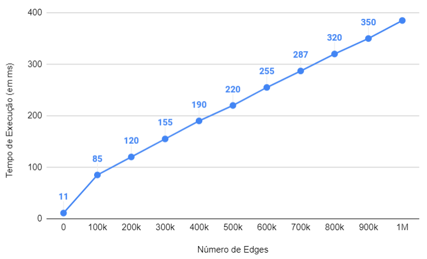

# Relatório 2º Projeto ASA 2022/2023 

## Grupo: tp012

**Alunos: David Pires (103458) Diogo Miranda (102536)**

## Descrição do Problema e da Solução

***

**Problema:** Dado um grafo G = (V,E), determinar o caminho de maior peso possível no grafo (Maximum Spanning Tree).

**Solução:** Aplicação do Algoritmo de Kruskal mas com uma pequena alteração. Até ao sort o algoritmo mantém-se porém depois percorre-se as edges do fim do vetor para o início (ordem decrescente) em vez do início do vetor para o fim (ordem crescente). Desta forma retira-se primeiro as edges de maior peso, obtendo-se a Maximum Spanning Tree.

## Análise Teórica

- Ler o input dado (simples loop que lê todas as entradas (#V, #E, edges)): O(E+2) = **O(E)**

- Criação do vetor para guardar os vértices e a sua raiz (e preenchimento): **O(V)**

- Criação do vetor para guardar as edges (e preenchimento): **O(E)** 

- Dar sort no vetor de edges (utilizada a função `sort()` da biblioteca `<algorithm>`): **O(E.log(E))**

- Implementação de Kruskal, percorrer todas as edges, O(E) vezes a complexidade de uma chamada à função `notCycle()`. Na função `notCycle()` todos os parents da tree com menor tamanho são unidos à maior àrvore, com compressão de caminhos percorre-se todos os vértices (± procura em àrvore binária, tem complexidade O(log(V))). Assim a complexidade é: **O(E.log(V))**

Complexidade Global:

$$O(E \times log(E)) + O(E \times log(V)) \in 
\left\{
\begin{array}{ll}
      O(E \times log(E)) & V > E\\
      O(E \times log(V)) & V < E\\
\end{array} 
\right.
$$

Note-se que a nossa implementação de Kruskal não utiliza o critério de desempate por rank na junção de àrvores pelo que a procura nas àrvores será mais lenta que log(V) no pior caso. A nossa implementação de Kruskal terá uma complexidade um pouco pior que a demonstrada.

***

Os seguintes resultados foram obtidos através de cortes do seguinte [teste](https://github.com/Dacops/ASA/blob/main/Projeto2/input.txt) com o comando `sed` de UNIX. Os resultados foram obtidos com a ferramenta [hyperfine](https://github.com/sharkdp/hyperfine) e são uma média de entre 100~200 testes.

Número de edges é maior que número de vértices, logo esta aplicação do algoritmo de Krustal deverá ser E.log(E). No gráfico esta função pode parecer linear mas E.log(E) também o parece para estes números elevados. f(E)=E é uma função linear, e f(E)=log(E) para estes números elevados cresce muito lentamente pelo que parece quase constante (log(100k)=16.61, ..., log(1M)=19.93).

Assim Podemos concluir que gráfico aproxima-se da função E. Pelo que suporta a nossa suposição da complexidade deste programa ser:

$$O(E \times log(E))$$

Com 0 edges o tempo de execução não é 0 uma vez que ainda são gerados anteriormente os vetores para receber os vértices e a sua respetiva raiz. Este exemplo utiliza 10000 vértices, pelo que este processo ainda vai demorar algum tempo. Também podemos concluir aqui que para inputs com muitos vértices e poucas edges a complexidade de gerar (e preencher) este vetor será maior do que resolver o problema, assim nestes casos a complexidade da solução será: 

$$O(V)$$
