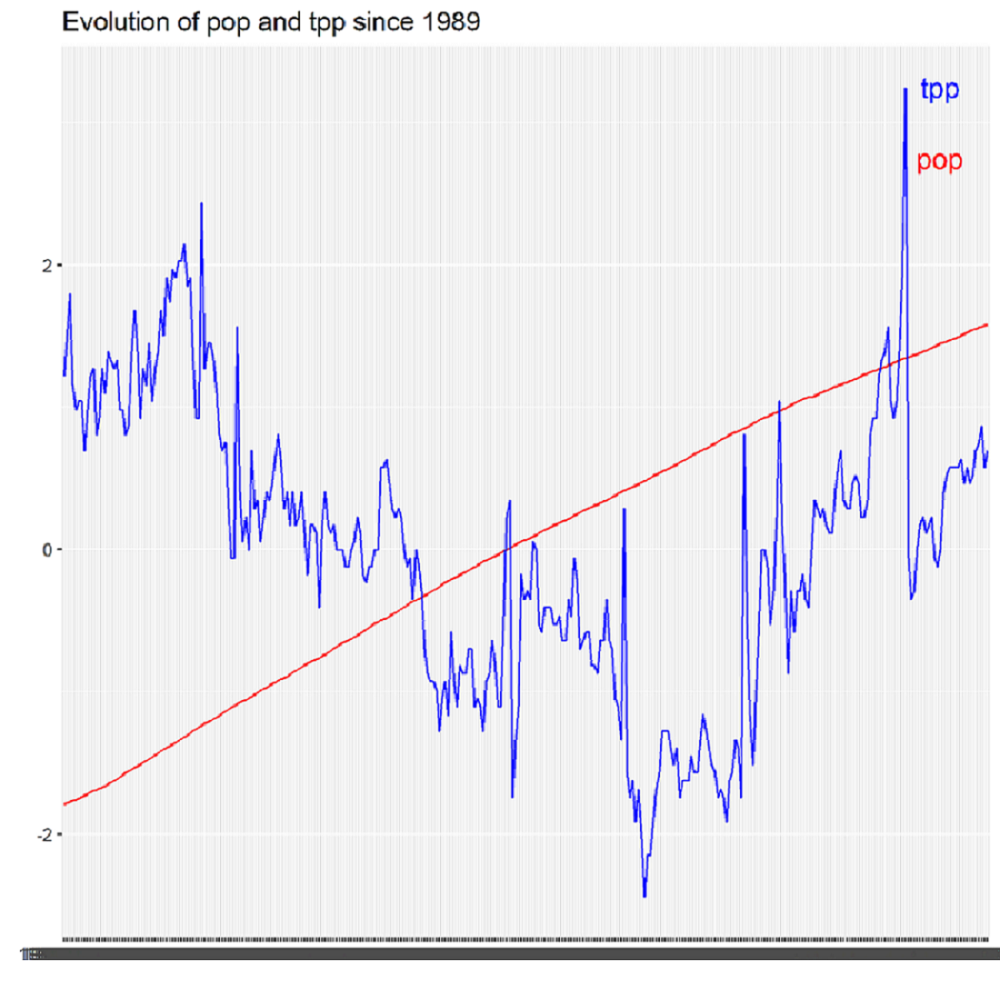

```r
library(readxl)
library(ggplot2)
data <- read_xlsx("data/econ.xlsx")
dates <- apply(data[, 1], 1, as.character)
years <- substr(dates, 1, 4)
filtered_data <- subset(data, years >= 1989)
time <- apply(filtered_data[, 1], 1, as.character)
pop <- apply(filtered_data[, 3], 1, as.numeric)
tpp <- apply(filtered_data[, 4], 1, as.numeric)
tr_pop <- apply(matrix(pop, ncol = length(pop)), 1, function(x) (x - mean(pop)) / sd(pop))
tr_tpp <- apply(matrix(tpp, ncol = length(tpp)), 1, function(x) (x - mean(tpp)) / sd(tpp))
graph_data <- data.frame(x = time, y1 = tr_pop, y2 = tr_tpp)
ggplot(graph_data, aes(x = x, group = 1)) +
  geom_line(aes(y = y1), color = "red") +
  geom_line(aes(y = y2), color = "blue") +
  xlab("") + ylab("") +
  ggtitle("Evolution of pop and tpp since 1989") +
  annotate("text", x = 300, y = 3.25, label = "tpp", size = 5, color = "blue") +
  annotate("text", x = 300, y = 2.75, label = "pop", size = 5, color = "red")
ggsave("graph.png")
```
