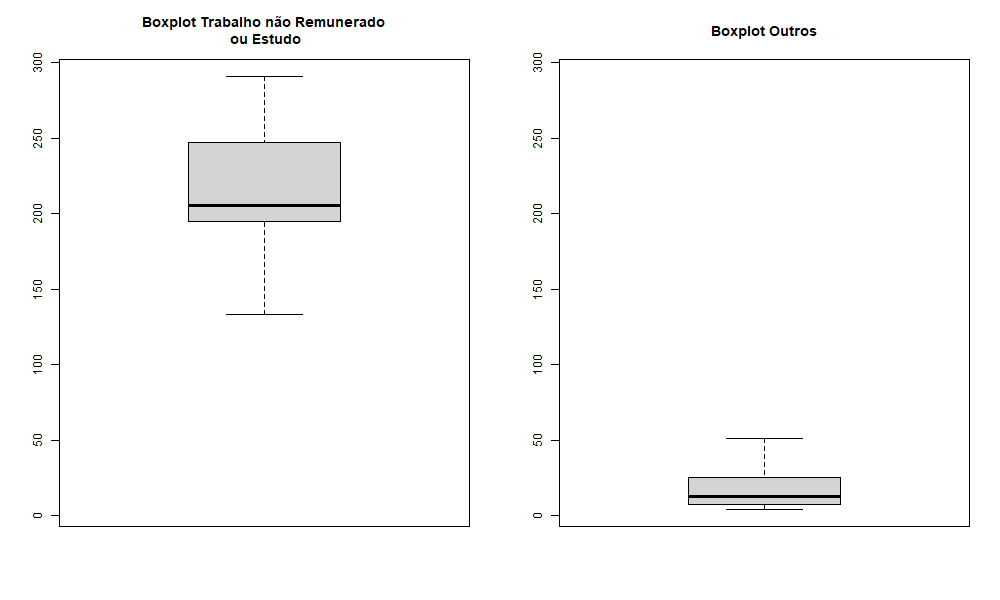

```r
data <- read.csv("data/TIME_USE_24092022.csv")

local <- data[, 1]
gender <- data[, 3]
filtered_data <- subset(data, gender == "Mulheres")
filtered_data <- subset(filtered_data, local != "África do Sul")

occupation <- filtered_data[, 2]
outros <- subset(filtered_data, occupation == "Outros")
work <- subset(filtered_data, occupation == "Trabalho remunerado ou estudo")
outros_vals <- outros[, 4]
work_vals <- work[, 4]

png("plots.png", width = 1000, height = 600)
par(mfcol = c(1, 2))
combined_vals <- c(work_vals, outros_vals)
ylim_range <- range(combined_vals)
boxplot(work_vals, ylim = ylim_range, main = "Boxplot Trabalho não Remunerado\n ou Estudo")
boxplot(outros_vals, ylim = ylim_range, main = "Boxplot Outros")

dev.off()


```

