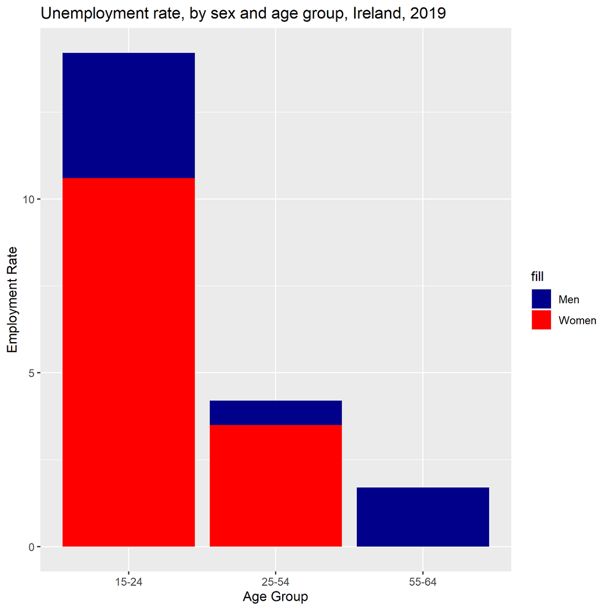

```r
library(ggplot2)
data <- read.table("data/GENDER_EMP_19032023152556091.txt", header = TRUE, sep = "\t")
filtered_data <- subset(data, COU == "IRL")
filtered_data <- subset(filtered_data, IND == "EMP3")
filtered_data <- subset(filtered_data, TIME == "2019")
men1524 <- subset(filtered_data, AGE == "1524" & Sex == "Men")
women1524 <- subset(filtered_data, AGE == "1524" & Sex == "Women")
men2554 <- subset(filtered_data, AGE == "2554" & Sex == "Men")
women2554 <- subset(filtered_data, AGE == "2554" & Sex == "Women")
men5564 <- subset(filtered_data, AGE == "5564" & Sex == "Men")
women5564 <- subset(filtered_data, AGE == "5564" & Sex == "Women")
df <- data.frame(age_group = c("15-24", "25-54", "55-64"),
                men_values = c(men1524$Value, men2554$Value, men5564$Value),
                women_values = c(women1524$Value, women2554$Value, women5564$Value))
ggplot(df, aes(x = age_group, y = men_values, fill = "Men")) + 
  geom_bar(stat = "identity", position = "dodge") +
  geom_bar(aes(y = women_values, fill = "Women"), stat = "identity", position = "dodge") +
  labs(title = "Unemployment rate, by sex and age group, Ireland, 2019",
       x = "Age Group", y = "Employment Rate") +
  scale_fill_manual(values = c("Men" = "darkblue", "Women" = "red"))
ggsave("graph.png")
```
