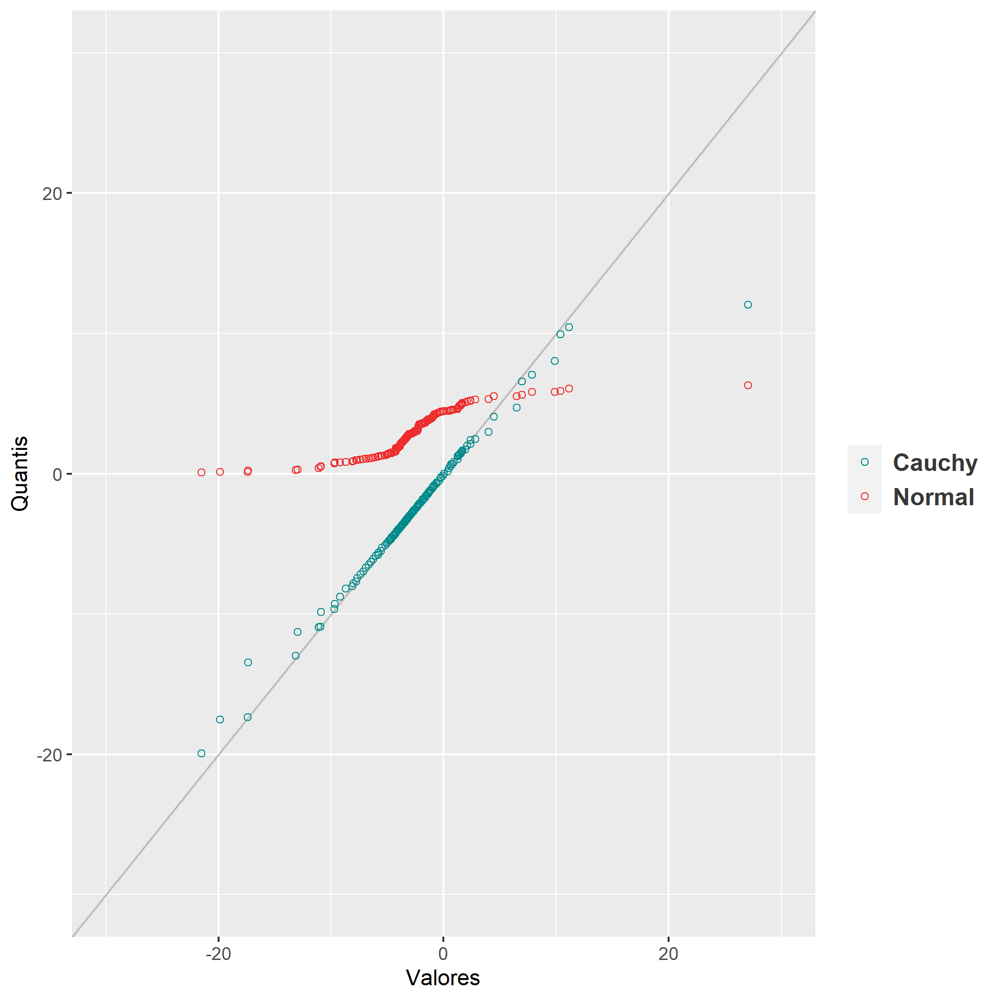

```r
library(ggplot2)

set.seed(1627)

x <- rcauchy(178, location=-2.8, scale=1.6)
y <- rnorm(178, mean=3, sd=sqrt(2.8))
cauchy <- sort(x)
norm <- sort(y)

quantis_cauchy <- quantile(x, probs=seq(1/179, 178/179, by=1/179))
quantis_norm <- quantile(y, probs=seq(1/179, 178/179, by=1/179))

df <- data.frame(qc=quantis_cauchy, qn=quantis_norm, val=cauchy)

ggplot(df, aes(x=val)) +
    geom_abline(intercept=0, slope=1, color='gray75') +
    geom_point(aes(y=qc, colour='cyan4'), shape=1) +
    geom_point(aes(y=qn, colour='firebrick2'), shape=1) +
    xlim(-30, 30) +
    ylim(-30, 30) +
    labs(y="Quantis", x="Valores") +
    scale_color_manual(labels=c("Cauchy", "Normal"), values=c("cyan4", "firebrick2")) +
    theme(legend.text=element_text(family="Arial", color="grey22", size=12,face="bold"),
        legend.title=element_blank())

ggsave("graph.png")
```
\
\
\
\
\
\
\
