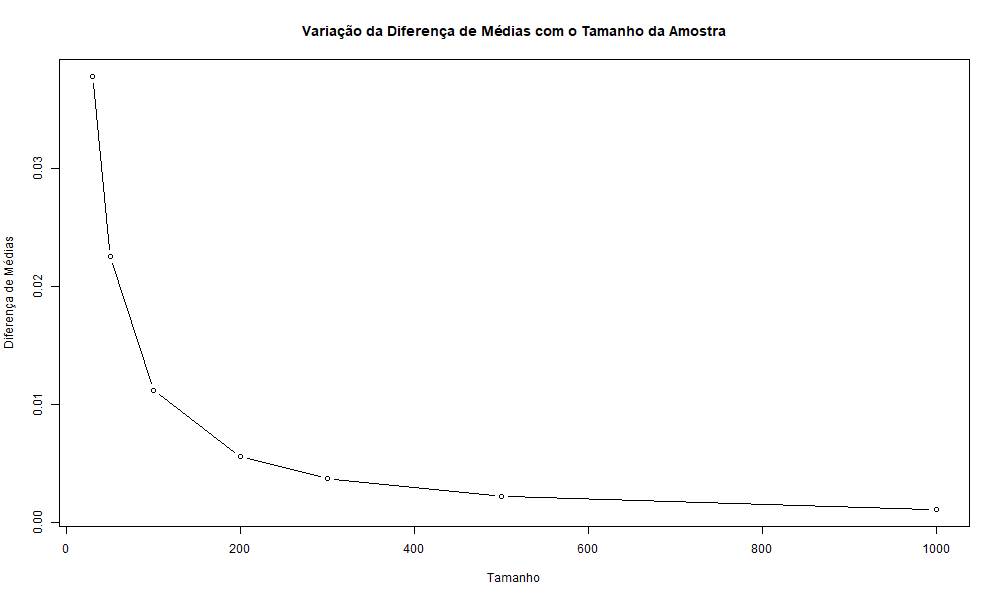

```r
set.seed(1615)

# Parâmetros iniciais
p <- 0.2
g <- 0.95
sizes <- c(30, 50, 100, 200, 300, 500, 1000)
k <- 1000

# Vetores para armazenar as médias das diferenças
mean_diffs <- rep(0, length(sizes))

# Função para calcular o intervalo de confiança pelo Método 1
interval_method1 <- function(x_bar, n, z) {
  p_hat <- x_bar
  a <- 1 + (z^2)/(2*n)
  b <- z * sqrt((p_hat*(1 - p_hat))/n + (z^2)/(4*n^2))
  lower <- (p_hat + (z^2)/(2*n) - b) / a
  upper <- (p_hat + (z^2)/(2*n) + b) / a
  return(c(lower, upper))
}

# Função para calcular o intervalo de confiança pelo Método 2
interval_method2 <- function(x_bar, n, z) {
  p_hat <- x_bar
  lower <- p_hat - z*sqrt(p_hat*(1 - p_hat)/n)
  upper <- p_hat + z*sqrt(p_hat*(1 - p_hat)/n)
  return(c(lower, upper))
}

# Loop pelos diferentes tamanhos de amostra
for (i in 1:length(sizes)) {
  n <- sizes[i]
  diff_lengths <- c()  # Initialize as an empty vector
  
  # Geração de k amostras de tamanho n
  for (j in 1:k) {
    samples <- rbinom(n, 1, p)
    x_bar <- mean(samples)
    z <- qnorm(g)
    
    # Intervalos de confiança pelos dois métodos
    interval1 <- interval_method1(x_bar, n, z)
    interval2 <- interval_method2(x_bar, n, z)
    
    # Diferença dos comprimentos dos intervalos
    diff_lengths <- c(diff_lengths, abs(interval2[2] - interval1[2]))  # Append to the vector
  }
  
  # Média das diferenças
  mean_diffs[i] <- mean(diff_lengths)
}

png("graph.png", width = 1000, height = 600)
plot(sizes, mean_diffs, type = "b",
     xlab = "Tamanho", ylab = "Diferença de Médias",
     main = "Variação da Diferença de Médias com o Tamanho da Amostra")
dev.off()
```
\
\
\
\
\
\
\


Verifica-se que quanto maior o tamanho de cada amostra, menor a diferença entre os comprimentos dos intervalos de confiança construídos pelo Método 2 e pelo Método 1. O que é esperado, uma vez que quanto maior a amostra mais exatas serão estas aproximações. 
